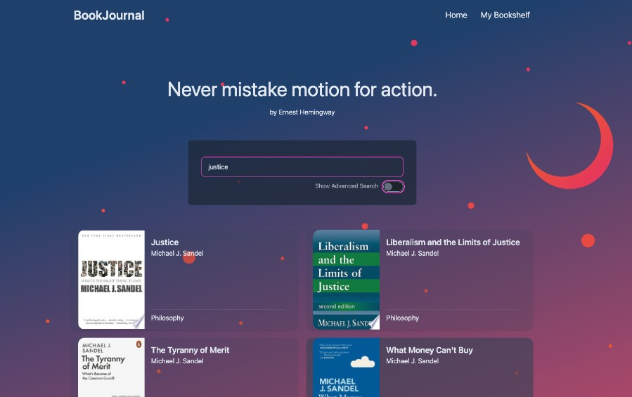

# [BookJournal]('https://books.megumi.no/)

BookJournal is a web application for book club members to manage their bookshelf (a private Goodreads app).
The web application allows users to create accounts, explore books, maintain reading list and post reviews and get recommendations.
The actual book data is from GoogleBook API.

This is a personal full stack project and an implementation of both frontend and backend tools, including database integration, API creation, and cloud deployment on AWS.

The app is fully functional but still in beta phase with ongoing developments to enhance functionality and user experience!

## Tech Stack

- **Postgres**: Database for storing book and user data.
- **Express**: Web framework for building the backend.
- **React**: Frontend library for building the user interface.
- **Node.js**: JavaScript runtime for server-side development.
- **DaisyUI**: UI components for a modern and responsive design.
- **TypeScript**: Strict syntactical superset of JavaScript for improved development.
- **AWS**: Cloud deployment
